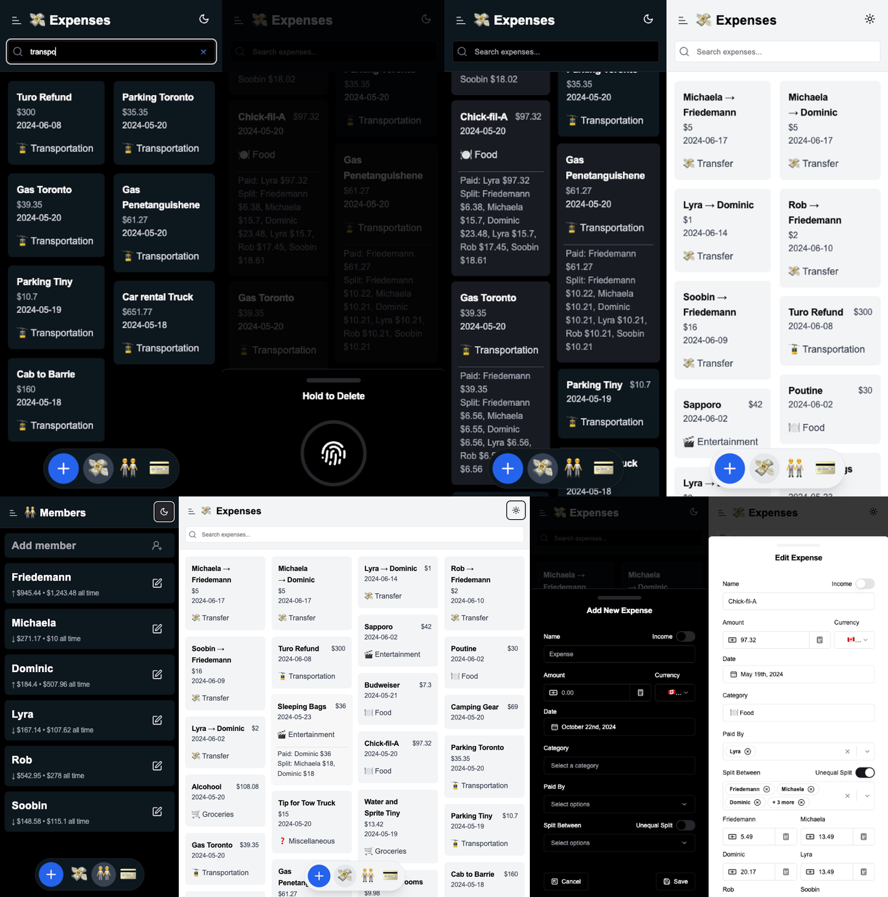

**Welcome to XPNZ**, your ultimate solution for tracking group expenses. This app simplifies expense sharing by helping you record, split, and manage group expenses with ease.



## 🚀 Project Overview

XPNZ is built using **React** with **Vite** for fast development. We use **ShadCN/UI** components for a modern UI and **TailwindCSS** for styling. The project structure ensures modularity and scalability, making it easy to maintain.

## 🌳 Project Structure

```
src
├── App.jsx
├── api                # Backend API utilities and configuration
├── assets             # App assets and media files
├── components         # Reusable React components and UI elements
│   └── ui             # ShadCN/UI-based components (alerts, forms, etc.)
├── hooks              # Custom React hooks
├── lib                # Helper utilities and functions
├── pages              # Main app pages (expenses, debts, members, etc.)
├── styles             # Global and component styles
└── vite-env.d.ts      # Type definitions for Vite
```

## 🛠️ Getting Started

1. **Clone the repository:**
   ```bash
   git clone https://github.com/tomginsberg/xpnz3.git
   cd xpnz3
   ```

2. **Install dependencies:**
   ```bash
   npm install
   ```

3. **Start the development server:**
   ```bash
   npm run dev
   ```

4. **Run the API server:**
   ```bash
   npm run api
   ```

5. **Access the app:**  
   Open [http://localhost:5173](http://localhost:5173) in your browser.

## 💡 Features

- **Expense Tracking:** Easily record and categorize group expenses.
- **Debt Management:** View individual debts and settle balances.
- **Weighted Splits:** Split expenses based on individual weights.
- **Multi Currency Support:** Manage expenses in multiple currencies.
- **Multi contribution**: Add multiple contributors to an expense.
- **Calculator Input**: Use a calculator to input expense amounts.
- **Category Picker with Emoji Support:** Use the emoji search to assign categories with ease.
- **Themed UI:** Switch themes with a toggle for personalized experiences.
- **Confetti and Animations:** Celebrate expenses with confetti effects.
- **Responsive Design:** Works seamlessly on all devices.

## ⚙️ Scripts

- **`npm run dev`** – Start the development server.
- **`npm run api`** – Launch the backend API.
- **`npm run build`** – Build the app for production.
- **`npm run preview`** – Preview the production build.

## 🔗 Links

- **GitHub Repository:** [XPNZ on GitHub](https://github.com/tomginsberg/xpnz3.git)
- **Linear for Issue Tracking & Discussions:** [Join us on Linear](https://linear.app/xpnz/join/f88e5d76f1d53546cc05c23a55d82937?s=1)

## 🧩 Technologies Used

- **React** with Vite
- **TailwindCSS** for styling
- **ShadCN/UI** for components
- **Radix UI** for accessibility
- **Linear** for issue tracking

## 📄 License

This project is licensed under the terms of the [MIT License](./LICENSE).